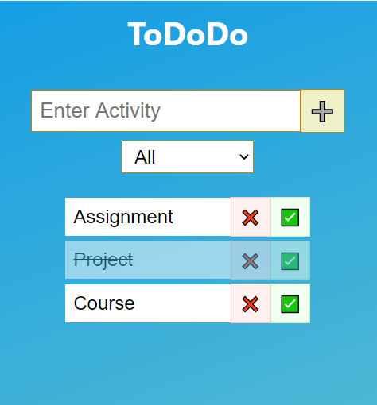

# ToDoDo: A ToDo List App Made Using React.js

A Simple ToDo App made using React.js. 
Could be helpful for the people learning React. 
This app also consists of Redux(State Management).

## To run this app..

### Run 'cd your-app-root-directory'

Navigate to the root folder where you copied the code.

### Run 'npm install'

Installs all the dependencies in a folder named 'node_modules'.

### Run 'npm start'

Runs the app in the development mode.\
Open [http://localhost:3000](http://localhost:3000) to view it in the browser.

## A few Screen Shots...

### All Tasks

    

### Completed Tasks

    

### Pending Tasks

    

